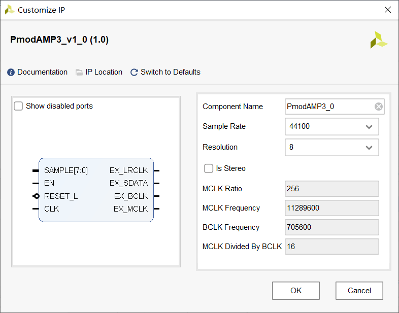

# PmodAmp3

使用 stand-alone 模式的 IP 核。

## 输入输出端口

- SAMPLE: 单次采样的音频数据，位宽由参数 `Resolution` 指定。如果选择了双声道 `Is Stereo`，则位宽翻倍，且高位是右声道。
- EN: 使能。
- RESET_L: 低有效的复位。
- CLK: 时钟，**频率应被设置为 `MCLK Frequency`**。

使用时，将 SAMPLE 和 EN 看作异步输入，则整个器件可以看作一个两输入的“组合逻辑”。

右侧四个端口为外部端口，见 [pmodamp3_rm.pdf](pdf/pmodamp3_rm.pdf) 的表 2。

- EX_LRCLK: LRCLK，对应 Pin 1。
- EX_SDATA: SDATA，对应 Pin 2。
- EX_BCLK: BCLK，对应 Pin 4。
- EX_MCLK: MCLK-E，对应 Pin 9。

跳线帽设置（装上表示连接方形孔和圆形孔，不装表示连在两个圆形孔上，或者对于只有两孔的可以直接拔下来）：

- JP2：装上。表示选择 MCLK，见 [pmodamp3_rm.pdf](pdf/pmodamp3_rm.pdf) 的图 2。
- JP3：装上。表示使用 I2S 规范。
- JP4：默认装上。装上表示 MCLK 倍率为 256，不装表示 MCLK 倍率为 384。
- JP5：不装。表示使用 stand-alone 模式。
- JP6：不装。表示使用 $0~\mathrm{dB}$，声音已经很大了。

似乎拿到器件的默认设置就如上所示。