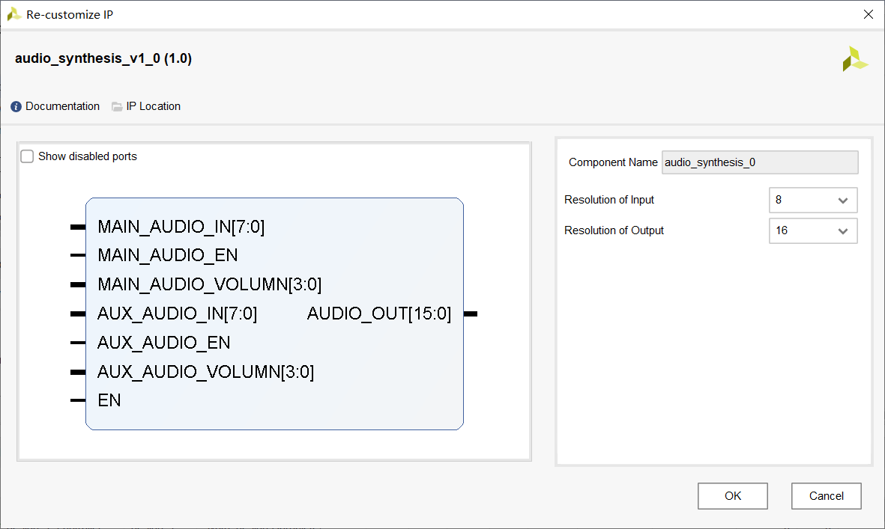

# audio_synthesis

简单的输出音频合成器，是一个组合逻辑。

## 输入输出端口



- MAIN_AUDIO_IN: 输入音频，位宽由参数 `Resolution of Input` 决定。

- MAIN_AUDIO_EN: 输入使能，如果为 0 则不在 AUDIO_OUT 中合成 MAIN。

- MAIN_AUDIO_VOLUMN: 输入音量。内部实现原理为：

  ```verilog
  AUDIO_OUT = AUDIO_OUT + (MAIN_AUDIO_IN << MAIN_AUDIO_VOLUMN);
  ```

  所以 0 表示最大音量，且值越大音量越小。该参数也反映了为何输入和输出的位宽可以不同的原因。

- AUX 开头的端口与 MAIN 开头的端口对等。

- EN: 使能。为 0 时输出始终为 0。

- AUDIO_OUT: 输出音频，位宽由参数 `Resolution of Output` 决定，显然该参数不应该小于 `Resolution of Input`。