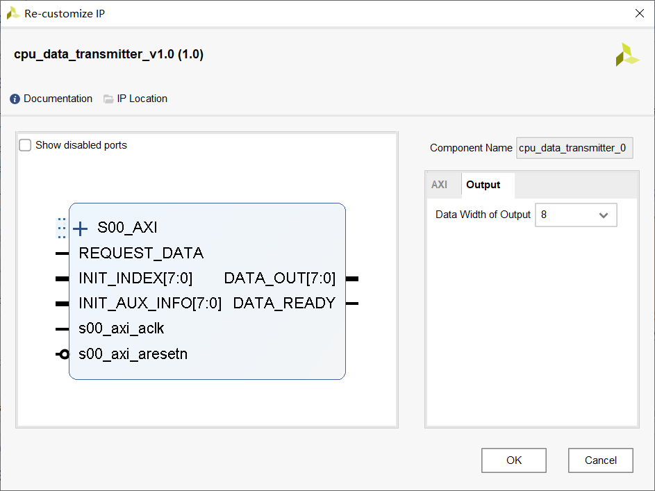

# cpu_data_transmitter

负责和 CPU 进行数据通信的模块。

## 输入输出端口



- S00_AXI: AXI 总线，使用自动连线功能连接即可。

- s00_axi_aclk: 时钟，使用自动连线功能连接即可，频率选 $100~\mathrm{MHz}$。

- s00_axi_aresetn: 低有效复位，使用自动连线功能连接即可。

- INIT_INDEX: 用于表示要读取数据的索引，在第一次使用时或者 RESTART 从 1 变为 0 之后读输入并将其作为之后输出数据的索引。

  例如，若 `INIT_INDEX == 3`，则之后读出的数据是 SD 卡中目录 `3/` 下的文件。

- INIT_AUX_INFO: 用于表示要读取数据的类型，生效时间同 INIT_INDEX。具体信息见之后的编码说明。

- REQUEST_DATA: 想要从该模块读一个数据。类似于一个水龙头，只保证打开水龙头有出水的倾向，关闭水龙头有不出水的倾向，不保证真正有水，也不保证出水量，也不保证关闭水龙头后“滴水不漏”。请配合 FIFO 使用。

- RESTART: 通知 CPU 复位。需要保持不定长的时间，复位后 CPU 将重新读取 INIT_INDEX 和 INIT_AUX_INFO。

- DATA_OUT: 读到的数据，一次读出的数据量取决于参数 `Data Width of Output`。见 DATA_READY 的说明。

- DATA_READY: 数据就绪的说明。当在时钟上升沿检查到 DATA_READY 为 1 时，说明 DATA_OUT 在上一个时钟已经被刷新，应当立刻将其取出放到他处。DATA_READY 只持续一个时钟周期，如果连续两个时钟周期都为 1，说明数据到达了两次。如果下一个时钟周期 DATA_READY 的值为 0，不保证 DATA_OUT 可以保持不变，所以要立即取出。

更详细的时序说明暂时省略，可以参见 REQUEST_DATA 和 DATA_READY。

AXI 页中的参数不要改。

## 编码与内部寄存器

该模块通过 AXI4 总线与 CPU 进行通信，相关原理不进行研究，下图给出了一个可行的解决方案（[参考资料](https://blog.csdn.net/tangkunjyy/article/details/62045863)）。

```mermaid
sequenceDiagram
CPU ->> (内存地址): cpu_data_transmitter 基地址
(内存地址) ->> 寄存器: 写到“从寄存器”
寄存器 ->> cpu_data_transmitter: 从“从寄存器”读
cpu_data_transmitter ->> 寄存器: 写到主寄存器
寄存器 ->> (内存地址): 从主寄存器读
(内存地址) ->> CPU: cpu_data_transmitter 基地址
CPU --> cpu_data_transmitter: AXI4
```

CPU 将数据写到 cpu_data_transmitter 的，自动生成的的 AXI4 相关代码会自动将写操作产生的数据保存到“从寄存器”中。而 CPU 需要读取数据时，数据来源于“主寄存器”。可见虽然地址一样，但是对应的数据是完全不同的，保存在了两组寄存器中。默认地（也不可修改），主寄存器和从寄存器的个数均为 4，各 128 比特（即每个寄存器是的 32 位）。

由于不使用 AXI 总线其他的信号，因此需要通过对比寄存器的数据进行同步，下面介绍寄存器中数据的编码。

### 从寄存器

- REGISTER_IN_0: 接收的数据，低 $n$ 位有效（$n = 8, 16, 32$，取决于参数 `Data Width of Output`）。

- REGISTER_IN_1: 保留。

- REGISTER_IN_2: 保留。

- REGISTER_IN_3: 进度数据，含义如下表所示。

  |        31        |  30  |  29  |            28            |        27:0        |
  | :--------------: | :--: | :--: | :----------------------: | :----------------: |
  | 传输是否正在进行 | 保留 | 保留 | 是否已经传输完成（保留） | 已传输的**字节**数 |

### 主寄存器

- REGISTER_OUT_0: 保留。

- REGISTER_OUT_1: 保留。

- REGISTER_OUT_2: 保留。

- REGISTER_OUT_3: 同步数据，含义如下表所示。

  |      31       |      30      | 29:16 |          15:8          | 7:0  |
  | :-----------: | :----------: | :---: | :--------------------: | :--: |
  | 通知 CPU 复位 | 是否需要数据 | 保留  | 附加信息（见下方注释） | 索引 |

  附加信息的含义如下表所示。

  |       15       | 14:11 |    10:8    |
  | :------------: | :---: | :--------: |
  | 是否是全局资源 | 保留  | 见以下说明 |

  附加信息最低两位的说明如下：

  - 0 表示 `.beatmap`。
  - 1 表示 `.object`。
  - 2 表示 `.pixel`。
  - 3 表示 `.timing`。
  - 4 表示 `.song`。
  - 5 表示 `.preview`。
  - 当 15 为 1 时，最低三位无效，总表示 `.skin`。
