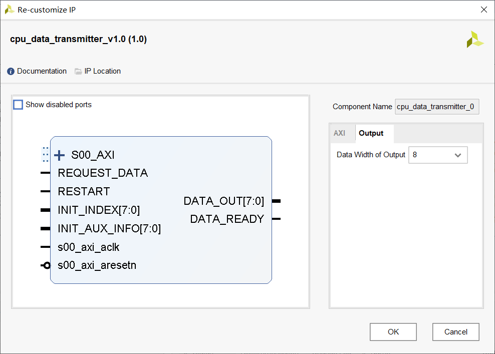

# cpu_data_transmitter

负责和 CPU 进行数据通信的模块。

## 输入输出端口

- S00_AXI: AXI 总线，使用自动连线功能连接即可。

- s00_axi_aclk: 时钟，使用自动连线功能连接即可，频率选 $100~\mathrm{MHz}$。

- s00_axi_aresetn: 低有效复位，使用自动连线功能连接即可。

- INIT_INDEX: 用于表示要读取数据的索引，在复位完成后的第一个时钟沿（待改进，计划之后加一个使能）读到输入并将其作为之后输出数据的索引。

  例如，若 `INIT_INDEX == 3`，则之后读出的数据是 SD 卡中目录 `3/` 下的文件。

- INIT_AUX_INFO: 用于表示要读取数据的类型，生效时间同 INIT_INDEX。具体信息见之后的编码说明。

- REQUEST_DATA: 想要从该模块读一个数据。类似于一个水龙头，只保证打开水龙头有出水的倾向，关闭水龙头有不出水的倾向，不保证真正有水，也不保证出水量，也不保证关闭水龙头后“滴水不漏”。

- DATA_OUT: 读到的数据，一次读出的数据量取决于参数 `Data Width of Output`。见 DATA_READY 的说明。

- DATA_READY: 数据就绪的说明。当在时钟上升沿检查到 DATA_READY 为 1 时，说明 DATA_OUT 在上一个时钟已经被刷新，应当立刻将其取出放到他处。DATA_READY 只持续一个时钟周期，如果连续两个时钟周期都为 1，说明数据到达了两次。如果下一个时钟周期 DATA_READY 的值为 0，不保证 DATA_OUT 可以保持不变，所以要立即取出。

更详细的时序说明暂时省略，可以参见 REQUEST_DATA 和 DATA_READY。

## 编码与内部寄存器